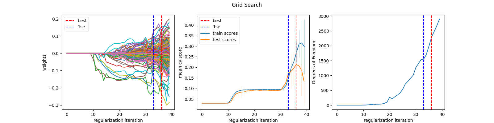
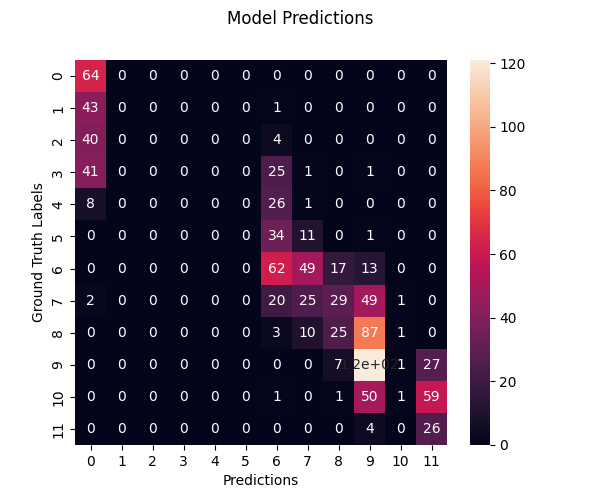
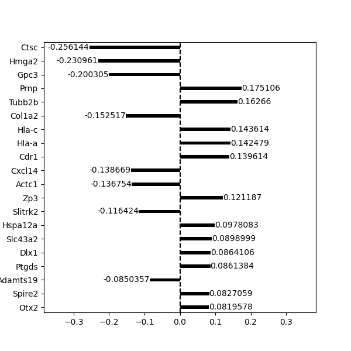
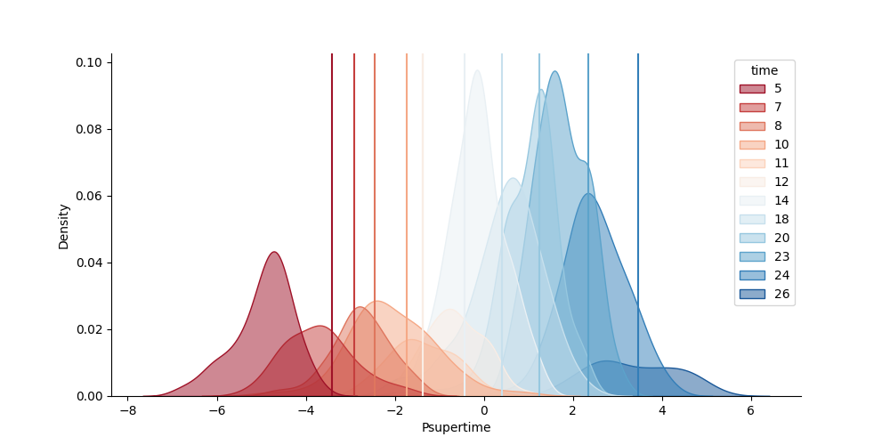

PyPsupertime
============

PyPsupertime is a scalable python re-implementation of the [R package `psupertime`](https://github.com/wmacnair/psupertime) for analysis of single-cell RNA sequencing data where the cell have an ordinal annotation (e.g. time series, or dosage).
It can be used to identify a small subset of cells which contribute to the ordering and reconstruct a pseudotime.

The original methodology is published in Bioinformatics: [https://doi.org/10.1093/bioinformatics/btac227](https://doi.org/10.1093/bioinformatics/btac227)


Getting Started
---------------

Install via pip:
```
pip install pypsupertime
```

This installs `pypsupertime` and its dependencies automatically

We recommend installing inside a [virtualenv](https://packaging.python.org/en/latest/guides/installing-using-pip-and-virtual-environments/) or [pipenv](https://github.com/pypa/pipenv) environment.


Description
-----------

This package implements a modular API for preprocessing of single cell data, restructuring of the input data under different statistical assumptions, as well as creating and fitting memory-efficient supervised ordinal logistic models.

The central idea of the original work remained unchanged: Find a linear model that accurately predicts the ordinal labels while being restricted to a sparse set of features (genes), by searching along a path of regularization hyperparameters. 
To adress memory inefficiencies in the original work, the coordinate descent approach is replaced in favor of a stochistic gradient descent model with online fitting. 
Additionaly, new parametrized penalties are possible, allowing more control over the sparsity.

From a statistical perspective, the ordinal nature of the input data can be modeled under the cumulative proportional odds, forward continuation ratio and backward continuation ratio assumption.

All model and preprocessing classes fit implement `scikit-learn` estimators or transformers to fit seamlessly into its ecosystem and are wrapped by the `Psupertime` class at the core of this pacakge that allows all input and output data to be represented as `anndata` objects.

Please find a more detailed description documentation hosted by readthedocs [here](https://pypsupertime.readthedocs.io/en/latest/).


Basic Usage
-----------

The code below runs a psupertime analysis with default settings on a data set represented as `AnnData` object and stored in a `.h5ad` file. 
The data has a numeric ordinal cell annotation representing stored in the `obs` dataframe under the key `"time"`.

```
from pypsupertime import Psupertime
p = Psupertime()
anndata = p.run("/path/to/data_sce.h5ad", "time")
```
```
Input Data: n_genes=24153, n_cells=992
Preprocessing: done. mode='all', n_genes=11305, n_cells=992
Grid Search CV: CPUs=4, n_folds=5
Regularization: done   
Refit on all data: done. accuracy=0.5195, n_genes=113
Total elapsed time:  0:01:26.141356
```

The code loads the single-cell data and perfoms default preprocessing, then runs a 5-fold cross validatied grid search along the default regularization path to identify the hyperparameter which results in the best-scoring sparse model, and finally refits the model with the ideal regularization on all data.
Using that model, relevant genes are identified and the psupertime is predicted for all cells.

The following snippets show how to quickly inspect and evaluate the results.
The regularization progress, model performance, and selected genes are shown here, but many more are available.

```
p.plot_grid_search(title="Grid Search")
```


```
p.plot_model_perf((adata.X, adata.obs.time), figsize=(6,5))
```


```
p.plot_identified_gene_coefficients(adata, n_top=20)
```


```
p.plot_labels_over_psupertime(adata, "time")
```


It is highly recommended to be aware of the preprocessing steps performed or perform key preprocessing manually.
For a complete overview, look at the [documentation](https://pypsupertime.readthedocs.io/en/latest/).


Development Roadmap
-------------------

- [ ] Extension of the `pypsupertime.plots` module with further analyses
- [x] Extension of the Preprocessing to allow custom pipelines (see version 1.1.0)
- [ ] Integration into the [scanpy](https://scanpy.readthedocs.io/en/stable/index.html) project
- [ ] Unit Tests, when the code is stable enough

Changelog:
----------

* Versions 1.1.1, 1.1.2, 1.1.3: 
    - Bugfixes

* Version 1.1.0: 
    - Add `preprocessing_class` parameter to enable using custom / no preprocessing
    - Adds heuristic for selecting the lowest regularization parameter when none is specified
    - Adds shorthand for selecting optimal regularization parameter at 1/2 standard error from the best score
    - Fix bug when using smooth with sparse matrices
